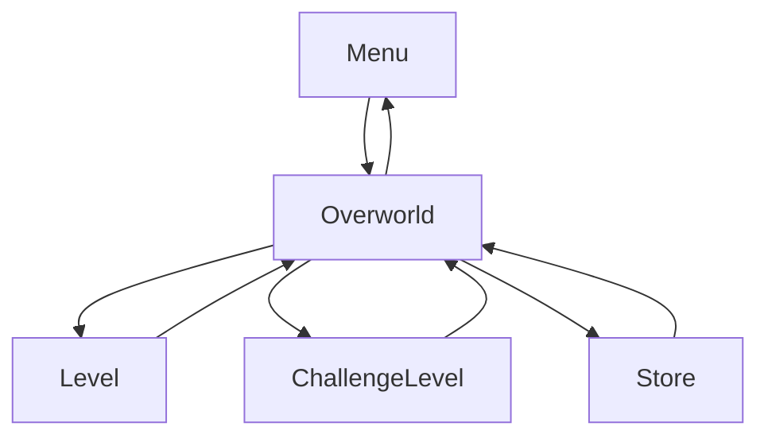

# Fighting-game

This game was done as an exercise to learn how to use rust, as such, I avoided using an engine and used only sdl for input, output, basic rendering.

# Approach

Since this was my first time trying to make a game without an engine, it is very experimental but.
In main.rs I have a state machine that keeps the states in a stack, starting with the menu.
There it runs in a game loop calling Scene trait .run(), where the result is either a new state, back, replace, and continue.

Each scene has its own loop where input is captured (this could be capture in the first loop and passed on to the scenes possibly)

# Difficulties

So Rust gamedev from what I gathered strives to be more component oriented than objected oriented, with a data oriented design approach, which was new to me.

My biggest difficulty was dealing with loops + objects with lifetimes inside of the loops + objects with lifetimes outside of the loops, in the end in many places i ended up replacing with clone or using Rc.

I would love to try Rust again, but for now this is shelved.

# Game in Action
https://youtu.be/LNBfO_3vjmE

